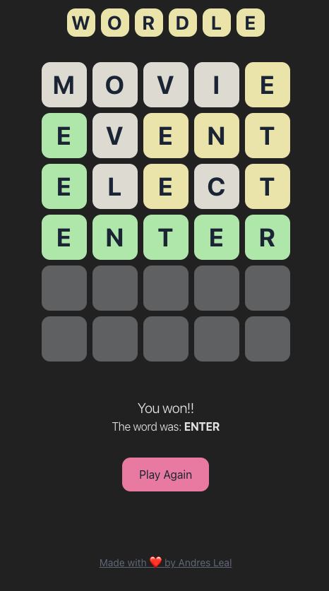

# Wordle Clone

A modern, interactive implementation of the popular word-guessing game Wordle, built with React and TypeScript.

## About

This is a fully functional Wordle clone that challenges players to guess a five-letter word within six attempts. After each guess, the tiles change color to provide feedback:

- 🟩 **Green**: Letter is correct and in the right position
- 🟨 **Yellow**: Letter is in the word but in the wrong position
- ⬜ **Gray**: Letter is not in the word

## Features

- Clean, intuitive user interface matching the classic Wordle aesthetic
- On-screen keyboard with real-time letter feedback
- Win/loss detection with result display
- Play again functionality to start a new game
- Responsive design for various screen sizes

## Tech Stack

- **React** with TypeScript for type-safe component development
- **Vite** for fast development and optimized builds
- Modern CSS for styling and animations

## Getting Started

1. Clone the repository
2. Install dependencies: `pnpm install`
3. Run the development server: `pnpm dev`
4. Build for production: `pnpm build`

---

Made with ❤️ by Andres Leal
